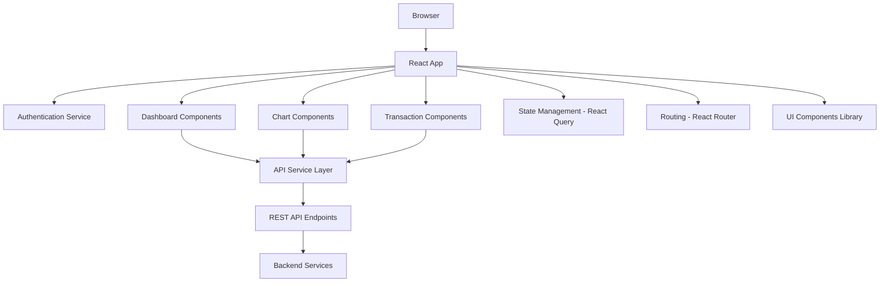

# Design Document

## Overview

The Merchant-Facing Fraud Dashboard is a React-based single-page application that provides real-time fraud protection analytics for e-commerce merchants. The application follows a component-based architecture with clear separation of concerns, utilizing modern React patterns including hooks, context API for state management, and responsive design principles.

The dashboard will be built using React 18+ with TypeScript for type safety, styled-components or CSS modules for styling, and Chart.js/Recharts for data visualization. The application will implement a real-time data fetching strategy using React Query for efficient caching and background updates.

## Architecture

### High-Level Architecture



### Component Architecture

The application follows a hierarchical component structure:

- **App Component**: Root component handling routing and global state
- **Layout Components**: Header, sidebar, main content area
- **Page Components**: Dashboard page, login page
- **Feature Components**: KPI cards, charts, transaction table
- **UI Components**: Buttons, inputs, modals, loading spinners

### State Management Strategy

- **React Query**: For server state management, caching, and background refetching
- **React Context**: For global UI state (theme, user preferences)
- **Local State**: Component-specific state using useState and useReducer hooks

## Components and Interfaces

### Core Components

#### 1. Dashboard Layout Component
```typescript
interface DashboardLayoutProps {
  children: React.ReactNode;
  user: User;
  onLogout: () => void;
}
```

Responsibilities:
- Render header with user info and logout
- Provide responsive grid layout for dashboard widgets
- Handle global loading and error states

#### 2. KPI Card Component
```typescript
interface KPICardProps {
  title: string;
  value: string | number;
  trend?: {
    direction: 'up' | 'down' | 'neutral';
    percentage: number;
  };
  tooltip?: string;
  loading?: boolean;
}
```

Responsibilities:
- Display individual KPI metrics
- Show trend indicators with color coding
- Provide hover tooltips for additional context

#### 3. Sales vs Fraud Chart Component
```typescript
interface SalesVsFraudChartProps {
  data: ChartDataPoint[];
  timeRange: '7d' | '30d' | '90d';
  onTimeRangeChange: (range: string) => void;
  loading?: boolean;
}

interface ChartDataPoint {
  date: string;
  sales: number;
  fraudAttempts: number;
}
```

Responsibilities:
- Render line chart with dual y-axes
- Handle time range selection
- Provide interactive tooltips and zoom functionality

#### 4. Decline Reasons Chart Component
```typescript
interface DeclineReasonsChartProps {
  data: DeclineReason[];
  loading?: boolean;
}

interface DeclineReason {
  reason: string;
  count: number;
  percentage: number;
  color: string;
}
```

Responsibilities:
- Render pie chart with decline reason breakdown
- Handle segment selection and highlighting
- Display legend with percentages

#### 5. Transaction Table Component
```typescript
interface TransactionTableProps {
  transactions: Transaction[];
  onTransactionClick: (transaction: Transaction) => void;
  loading?: boolean;
}

interface Transaction {
  id: string;
  customerName: string;
  amount: number;
  currency: string;
  status: 'approved' | 'declined' | 'in_review';
  riskScore: number;
  timestamp: string;
  declineReason?: string;
}
```

Responsibilities:
- Display paginated transaction list
- Implement risk score color coding
- Handle row selection and detail view

### API Service Layer

#### Authentication Service
```typescript
interface AuthService {
  login(credentials: LoginCredentials): Promise<AuthResponse>;
  logout(): Promise<void>;
  refreshToken(): Promise<string>;
  getCurrentUser(): Promise<User>;
}
```

#### Dashboard Data Service
```typescript
interface DashboardService {
  getKPIs(timeRange: string): Promise<KPIData>;
  getSalesVsFraudData(timeRange: string): Promise<ChartDataPoint[]>;
  getDeclineReasons(timeRange: string): Promise<DeclineReason[]>;
  getRecentTransactions(limit: number): Promise<Transaction[]>;
  getTransactionDetails(id: string): Promise<TransactionDetails>;
}
```

## Data Models

### User Model
```typescript
interface User {
  id: string;
  email: string;
  merchantName: string;
  role: 'admin' | 'viewer';
  preferences: UserPreferences;
}

interface UserPreferences {
  theme: 'light' | 'dark';
  defaultTimeRange: '7d' | '30d' | '90d';
  notifications: boolean;
}
```

### KPI Data Model
```typescript
interface KPIData {
  totalSales: {
    value: number;
    currency: string;
    trend: TrendData;
  };
  ordersApproved: {
    count: number;
    trend: TrendData;
  };
  ordersDeclined: {
    count: number;
    trend: TrendData;
  };
  chargebackRate: {
    percentage: number;
    trend: TrendData;
  };
}

interface TrendData {
  direction: 'up' | 'down' | 'neutral';
  percentage: number;
  comparisonPeriod: string;
}
```

### Chart Data Models
```typescript
interface ChartDataPoint {
  date: string;
  sales: number;
  fraudAttempts: number;
}

interface DeclineReason {
  reason: string;
  count: number;
  percentage: number;
  color: string;
}
```

## Error Handling

### Error Boundary Implementation
- Global error boundary to catch and display unhandled React errors
- Component-level error boundaries for critical sections
- Graceful degradation when individual components fail

### API Error Handling
- Centralized error handling in API service layer
- Retry logic for transient failures
- User-friendly error messages for different error types
- Offline state detection and messaging

### Error States
- Loading states with skeleton components
- Empty states when no data is available
- Error states with retry options
- Network connectivity indicators

## Testing Strategy

### Unit Testing
- Component testing using React Testing Library
- Service layer testing with mocked API responses
- Utility function testing
- Custom hook testing

### Integration Testing
- End-to-end user flows using Cypress or Playwright
- API integration testing
- Authentication flow testing
- Real-time data update testing

### Performance Testing
- Component rendering performance
- Chart rendering with large datasets
- Memory leak detection
- Bundle size optimization

### Accessibility Testing
- Automated accessibility testing with axe-core
- Keyboard navigation testing
- Screen reader compatibility testing
- Color contrast validation

## Security Considerations

### Authentication & Authorization
- JWT token-based authentication
- Automatic token refresh
- Secure token storage (httpOnly cookies)
- Role-based access control

### Data Protection
- HTTPS enforcement
- Input sanitization
- XSS prevention
- CSRF protection

### Privacy
- No sensitive data in localStorage
- Secure session management
- Data encryption in transit

## Performance Optimization

### Code Splitting
- Route-based code splitting
- Component lazy loading
- Dynamic imports for heavy libraries

### Data Fetching
- React Query for intelligent caching
- Background refetching
- Optimistic updates
- Pagination for large datasets

### Rendering Optimization
- React.memo for expensive components
- useMemo and useCallback for expensive calculations
- Virtual scrolling for large transaction lists
- Chart data sampling for performance

## Responsive Design

### Breakpoints
- Mobile: 320px - 768px
- Tablet: 768px - 1024px
- Desktop: 1024px+

### Mobile Adaptations
- Collapsible navigation
- Stacked KPI cards
- Simplified chart views
- Touch-friendly interactions

### Progressive Enhancement
- Core functionality works without JavaScript
- Enhanced experience with JavaScript enabled
- Graceful degradation for older browsers